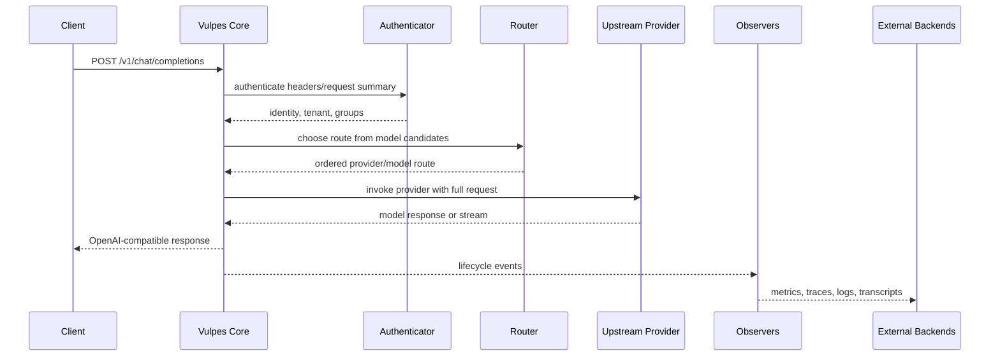
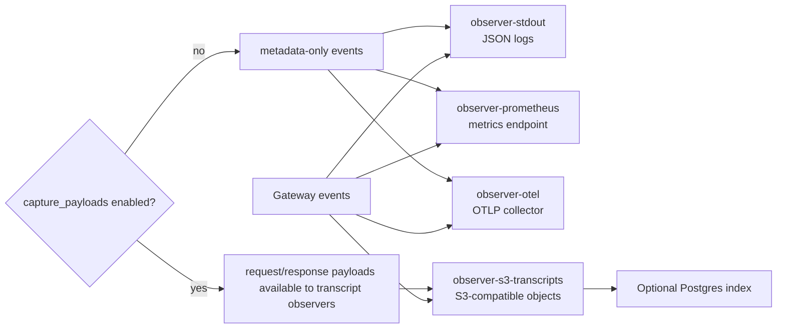

# Vulpes Core Plugins

Reference plugins for [`vulpes-core`](https://github.com/FenkoHQ/vulpes-core), the stateless OpenAI-compatible LLM gateway.

The core provides the HTTP data plane and strict capability contracts. This repository provides concrete plugin implementations for authentication, routing, upstream providers, observability, prompt handling, caching, and rate limiting.

## Included plugins

| Plugin | Capability | Purpose |
| --- | --- | --- |
| `authn-static-api-key` | `authenticator` | Static API-key authentication for local, test, and small self-hosted deployments. |
| `authn-postgres-api-key` | `authenticator` | Database-backed API-key authentication. |
| `cache-memory` | `cache_provider` | In-process TTL response cache. |
| `ratelimit-memory` | `rate_limiter` | In-process fixed-window request/token rate limiter. |
| `router-weighted` | `router` | Simple ordered, shuffled, or weighted route selection. |
| `router-litellm` | `router` | LiteLLM-style routing with load balancing, fallbacks, RPM/TPM limits, cooldowns, and feedback metrics. |
| `router-consul` | `router` | Discovers healthy OpenAI-compatible instances from Consul service discovery. |
| `prompt-context-injector` | `prompt_provider` | Injects or replaces prompt context by key, model, tenant, or subject. |
| `prompt-template-registry` | `prompt_provider` | Static versioned prompt registry with template rendering. |
| `upstream-openai` | `upstream_provider` | OpenAI-compatible upstream provider. |
| `upstream-codex` | `upstream_provider` | Codex/code-model upstream provider using the OpenAI Responses API. |
| `observer-stdout` | `observer` | JSON event sink for development and simple logging. |
| `observer-prometheus` | `observer` | Prometheus metrics exporter for gateway events and usage. |
| `observer-otel` | `observer` | OTLP/HTTP telemetry exporter. |
| `observer-s3-transcripts` | `observer` | Transcript writer for S3-compatible object storage with optional Postgres index. |

## How plugins fit into Vulpes

```mermaid
flowchart TB
    Core["Vulpes Core"] --> AuthN["Authenticator"]
    Core --> Cache["CacheProvider"]
    Core --> Limit["RateLimiter"]
    Core --> Router["Router"]
    Core --> Upstream["UpstreamProvider"]
    Core --> Prompt["PromptProvider"]
    Core --> Observer["Observer"]

    AuthN --> StaticKey["authn-static-api-key"]
    AuthN --> PgKey["authn-postgres-api-key"]
    Cache --> MemoryCache["cache-memory"]
    Limit --> MemoryLimit["ratelimit-memory"]
    Router --> Weighted["router-weighted"]
    Router --> LiteLLM["router-litellm"]
    Router --> Consul["router-consul"]
    Upstream --> OpenAI["upstream-openai"]
    Upstream --> Codex["upstream-codex"]
    Prompt --> Context["prompt-context-injector"]
    Prompt --> Templates["prompt-template-registry"]
    Observer --> Stdout["observer-stdout"]
    Observer --> Prom["observer-prometheus"]
    Observer --> OTel["observer-otel"]
    Observer --> S3["observer-s3-transcripts"]
```



## Request lifecycle with plugins



## Observability and transcript flow



## Build and test

```bash
make test
make lint
make build
```

Binaries are written to `bin/`.

## Example gateway config

See [`examples/gateway.yaml`](examples/gateway.yaml) for a complete local configuration. A plugin entry has this general shape:

```yaml
plugins:
  - name: openai
    source:
      type: filesystem
      path: ./bin/upstream-openai
    capabilities: [upstream_provider]
    fail_mode: closed
    config:
      base_url: https://api.openai.com/v1
      api_key: ${secret:OPENAI_API_KEY}
```

The core resolves `${secret:NAME}` references from its configured secret providers and passes only the scoped configuration to the plugin.

## Security notes

- Plugins receive only the data required by their declared capability.
- Upstream providers necessarily receive full model requests.
- Observers receive payloads only when the core has payload capture enabled.
- `observer-stdout` can be configured with `include_payloads: false` to avoid duplicating transcript bodies in logs.
- `observer-s3-transcripts` supports tenant bypass lists for deployments that must skip transcript object/index writes for selected tenants.
- Do not commit raw provider API keys, database URLs, object storage credentials, or tenant secrets to this repository.

## Documentation

The repository wiki contains public-facing documentation for plugin installation, configuration, operations, and development. Each plugin directory also includes a focused README with its schema and examples.

## License

AGPL-3.0-only. See [LICENSE](LICENSE).
